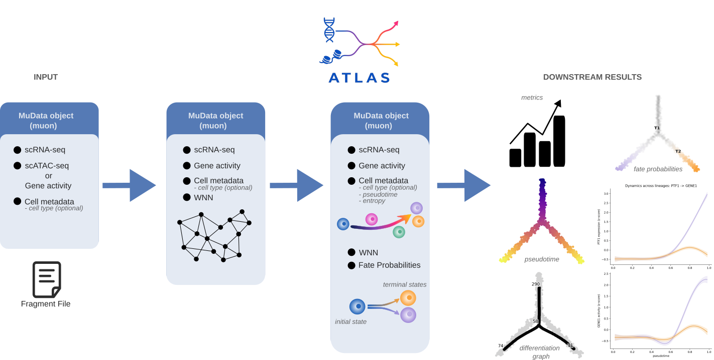
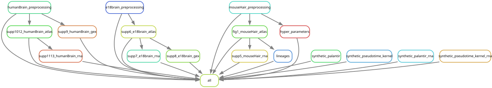

# ATLAS - Advanced Trajectory Learning from multi-omics At Single-cell resolution
This repository contains the code associated to the original paper from ATLAS- Advanced Trajectory Learning from multi-omics At Single-cell resolution.

ATLAS is Python package for multi-omic Trajectory Inference (TI) from paired single-cell RNA-seq and ATAC-seq data. Since chromatin accessibility reflects regulatory potential and often precedes transcriptional changes, integrating it with RNA expression provides a more complete view of cellular dynamics than transcriptomics alone. ATLAS extends established TI frameworks to jointly leverage multi-omics data, allowing chromatin accessibility to directly inform pseudotime ordering and fate probabilities.

ATLAS is scverse-compatible and currently under review for inclusion in the [scverse](https://scverse.org/) ecosystem. ATLAS source code can be found [here](https://github.com/smilies-polito/atlas-smilies).




## Release Notes 
v0.1.0:
- First release

## How To Cite:
### ATLAS Primary Publication 
- Publication will come soon

### Related Works
- Lange, M., Bergen, V., Klein, M. et al. CellRank for directed single-cell fate mapping. Nat Methods 19, 159–170 (2022). https://doi.org/10.1038/s41592-021-01346-6
- Weiler, P., Lange, M., Klein, M. et al. CellRank 2: unified fate mapping in multiview single-cell data. Nat Methods 21, 1196–1205 (2024). https://doi.org/10.1038/s41592-024-02303-9
- Setty, M., Kiseliovas, V., Levine, J. et al. Characterization of cell fate probabilities in single-cell data with Palantir. Nat Biotechnol 37, 451–460 (2019). https://doi.org/10.1038/s41587-019-0068- Li, H., Zhang, Z., Squires, M. et al. scMultiSim: simulation of single-cell multi-omics and spatial data guided by gene regulatory networks and cell–cell interactions. Nat Methods 22, 982–993 (2025). https://doi.org/10.1038/s41592-025-02651-0

### Datasets
- Fresh Embryonic E18 Mouse Brain (5k), Single Cell Multiome ATAC + Gene Expression Dataset by Cell Ranger ARC 2.0.0, 10x Genomics, (2021, May 3).
- Sai Ma et al. Chromatin Potential Identified by Shared Single-Cell Profiling of RNA and Chromatin. Cell, 183(4):1103–1116.e20, November 2020.
- Alexandro E. Trevino et al. Chromatin and gene-regulatory dynamics of the developing human cerebral cortex at single-cell resolution. Cell, 184(19):5053–5069.e23, September 2021.

### Experimental Setup 

Follow these steps to setup for reproducing the experiments. 

1. Install `Singularity` version 1.4.5 from [this link](https://docs.sylabs.io/guides/3.0/user-guide/installation.html).
2. Install `hstlib` version 1.21 from [this link](https://www.htslib.org/download/)
3. Clone the repository in your home folder via
```bash
```
4. Move to the repository folder and build the `singularity` container with:
```bash
cd scvemo/container
sudo singularity build container.sif container.def 
```
or 
```bash
cd scvemo/container
singularity build --fakeroot container.sif container.def 
```

## Reproduce Analyses
### Required Data and Input Folders
Input data must be downloaded and places in the `scvemo/data` folder under the correct dataset-related subfolder. Here we provide the urls for the data, the related subfolder and the minimum files to download to endure correct reproducibility, along with bash scripts:

| Dataset | URLs | Subfolder | Mandatory Files |
|---|---|---|---|
| Fresh Embryonic E18 Mouse Brain | [10x Genomics](https://www.10xgenomics.com/datasets/fresh-embryonic-e-18-mouse-brain-5-k-1-standard-2-0-0) | `scvemo/data/embryonic_mouse_brain` | `filtered_feature_bc_matrix/`, `e18_mouse_brain_fresh_5k_atac_fragments.tsv.gz` |
| SHARE-seq Mouse Hair Follicle | [scATAC-seq](https://www.ncbi.nlm.nih.gov/geo/query/acc.cgi?acc=GSM4156597), [scRNA-seq](https://www.ncbi.nlm.nih.gov/geo/query/acc.cgi?acc=GSM4156608) | `scvemo/data/mouse_hair` | `GSM4156608_skin.late.anagen.rna.counts.txt`, `GSM4156597_skin.late.anagen.counts.txt`, `GSM4156597_skin.late.anagen.barcodes.txt`, `GSM4156597_skin.late.anagen.peaks.bed`, `GSM4156597_skin_celltype.txt`, `GSM4156597_skin.late.anagen.atac.sorted.fragments.bed.gz` |
| Human Fetal Brain | [GEO: GSE162170](https://www.ncbi.nlm.nih.gov/geo/query/acc.cgi?acc=GSE162170) | `scvemo/data/human_brain` | `GSE162170_multiome_cluster_names.txt`, `GSE162170_multiome_cell_metadata.txt`, `GSE162170_multiome_rna_counts.tsv.gz`, `GSE162170_multiome_atac_gene_activities.tsv.gz` |
| Synthetic data generated via scMultiSim | [Link]() | `scvemo/data/synthetic_data` | |

Fresh Embryonic E18 Mouse Brain:
```bash
cd scvemo/data/embryonic_mouse_brain
curl -O https://cf.10xgenomics.com/samples/cell-arc/2.0.0/e18_mouse_brain_fresh_5k/e18_mouse_brain_fresh_5k_filtered_feature_bc_matrix.tar.gz
tar -xvf e18_mouse_brain_fresh_5k_filtered_feature_bc_matrix.tar.gz
curl -O https://cf.10xgenomics.com/samples/cell-arc/2.0.0/e18_mouse_brain_fresh_5k/e18_mouse_brain_fresh_5k_atac_fragments.tsv.gz
curl -O https://cf.10xgenomics.com/samples/cell-arc/2.0.0/e18_mouse_brain_fresh_5k/e18_mouse_brain_fresh_5k_atac_fragments.tsv.gz.tbi
```

SHARE-seq Mouse Hair Follicle:
```bash
cd scvemo/data/mouse_hair
curl -O https://ftp.ncbi.nlm.nih.gov/geo/samples/GSM4156nnn/GSM4156597/suppl/GSM4156597_skin_celltype.txt.gz
curl -O https://ftp.ncbi.nlm.nih.gov/geo/samples/GSM4156nnn/GSM4156597/suppl/GSM4156597_skin.late.anagen.counts.txt.gz
curl -O https://ftp.ncbi.nlm.nih.gov/geo/samples/GSM4156nnn/GSM4156597/suppl/GSM4156597_skin.late.anagen.peaks.bed.gz
curl -O https://ftp.ncbi.nlm.nih.gov/geo/samples/GSM4156nnn/GSM4156608/suppl/GSM4156608_skin.late.anagen.rna.counts.txt.gz
curl -O https://ftp.ncbi.nlm.nih.gov/geo/samples/GSM4156nnn/GSM4156597/suppl/GSM4156597_skin.late.anagen.barcodes.txt.gz
curl -O https://ftp.ncbi.nlm.nih.gov/geo/samples/GSM4156nnn/GSM4156597/suppl/GSM4156597_skin.late.anagen.atac.fragments.bed.gz

gunzip GSM4156597_skin_celltype.txt.gz
gunzip GSM4156597_skin.late.anagen.barcodes.txt.gz
gunzip GSM4156597_skin.late.anagen.counts.txt.gz
gunzip GSM4156608_skin.late.anagen.rna.counts.txt.gz
gunzip GSM4156597_skin.late.anagen.peaks.bed.gz
gunzip GSM4156597_skin.late.anagen.atac.fragments.bed.gz
sort -k1,1 -k2,2n GSM4156597_skin.late.anagen.atac.fragments.bed > GSM4156597_skin.late.anagen.atac.fragments.sorted.bed
bgzip GSM4156597_skin.late.anagen.atac.fragments.sorted.bed
tabix -p bed GSM4156597_skin.late.anagen.atac.fragments.sorted.bed.gz
```

Human Fetal Brain: 
```bash
cd scvemo/data/human_brain
curl -O https://ftp.ncbi.nlm.nih.gov/geo/series/GSE162nnn/GSE162170/suppl/GSE162170_multiome_atac_gene_activities.tsv.gz
curl -O https://ftp.ncbi.nlm.nih.gov/geo/series/GSE162nnn/GSE162170/suppl/GSE162170_multiome_cell_metadata.txt.gz
curl -O https://ftp.ncbi.nlm.nih.gov/geo/series/GSE162nnn/GSE162170/suppl/GSE162170_multiome_rna_counts.tsv.gz
curl -O https://ftp.ncbi.nlm.nih.gov/geo/series/GSE162nnn/GSE162170/suppl/GSE162170_multiome_cluster_names.tsv.gz

gunzip GSE162170_multiome_cluster_names.tsv.gz
gunzip GSE162170_multiome_cell_metadata.txt.gz
```

Simulated Data:
```bash
```


### Output Folders
All results generated by this repository are stored in the `scvemo/output` directory.

| Dataset | Output Subfolder | Folder Content |
|---|---|---|
| Fresh Embryonic E18 Mouse Brain | `scvemo/output/embryonic_mouse_brain` | Files, models, and intermediate results generated from analyses on the Fresh Embryonic E18 Mouse Brain dataset |
| SHARE-seq Mouse Hair Follicle | `scvemo/output/mouse_hair` | Files, models, and intermediate results generated from analyses on the SHARE-seq Mouse Hair Follicle dataset |
| Human Fetal Brain | `scvemo/output/human_brain` | Files, models, and intermediate results generated from analyses on the Human Fetal Brain dataset |
| Synthetic Data | `scvemo/output/simulations` | Files, models, and intermediate results generated from synthetic simulations |

Results and intermediate files generated during synthetic simulations are further organized into experiment-specific subfolders such as `scvemo/output/simulations/palantir`, `scvemo/output/simulations/palantir_rna`, etc.

Figures are saved in `scvemo/figures` as performed in [scanpy](https://scanpy.readthedocs.io/) and [muon](https://muon.scverse.org/). 

### Run Experiments

The full analysis is implemented as a Snakemake workflow that runs inside an `apptainer` (`singularity`) container. The pipeline processes the three real datasets and the grid of synthetic simulations. 
Snakemake is available in the container. 
The pipeline has been tested on SLURM; other schedulers require adapting the profile. 

To verify the envrionment run:
```bash
apptainer --version
apptainer exec container/container.sif snakemake --version
```

Before running populate the `data/` subfolders with the input files as described in the previous sections and perform a dry run to confirm the DAG resolves correctly. The dry run should enlist a total of 7400 rules. 
```bash
apptainer exec container/container.sif snakemake -n
```

To list all target filed that would be produces by `rule all`, run:
```bash
apptainer exec container/container.sif snakemake --list-target-rules
```

To locally run all jobs on as single node using all available cores, run:
```bash
mkdir -p logs
apptainer exec container/container.sif snakemake --cores all
```

To run experiments on a SLURM cluster (recommended), wrap the call into an `sbatch` script. This work on any slurm cluster, as long as the `#SBATCH` directives are adapted to the site's partition.
```bash
# submit.sh
#!/bin/bash
#SBATCH --job-name=ATLAS
#SBATCH --partition=
#SBATCH --cpu-per-task=
#SBATCH --mem
#others

mkdir -p logs
apptainer exec container/container.sif snakemake --cores 32
```

Then: 
```bash
sbatch submit.sh
```

It is not mandatory to run the entire workflow. Snakemake can target individual output files or rules and it will automatically execute all the upstream rules rerquired to produce them. Here we provide an overview of the available rules:
| Rule | Dataset | Outcome |
| --- | --- | --- |
| humanBrain\_preprocessing | Human Fetal Brain | Preprocesses the Human Fetal Brain data and outputs `.h5mu` files (both `brain` and `brainR`) |
| supp1012\_humanBrain\_atlas | Human Fetal Brain | Applies ATLAS (both TI strategies) on the Human Fetal Brain and produces results from Supp. Fig. 10 and 12 |
| supp1113\_humanBrain\_rna | Human Fetal Brain | Applies scRNA-seq only based TI on the Human Fetal Brain and produces results from Supp. Fig. 11 and 13 |
| supp9\_humanBrain\_gex | Human Fetal Brain | Gene Expression for target genes on the Human Fetal Brain and produces results from Supp. Fig. 9 |
| e18brain\_preprocessing | Fresh Embryonic E18 Mouse Brain | Preprocesses the E18 Mouse Brain data and outputs `.h5mu` file |
| supp6\_e18brain\_atlas | Fresh Embryonic E18 Mouse Brain | Applies ATLAS (both TI strategies) on the E18 Mouse Brain and produces results from Supp. Fig. 6 |
| supp7\_e18brain\_rna | Fresh Embryonic E18 Mouse Brain | Applies scRNA-seq only based TI on the E18 Mouse Brain and produces results from Supp. Fig. 7 |
| supp8\_e18brain\_gex | Fresh Embryonic E18 Mouse Brain | Gene Expression for target genes on the E18 Mouse Brain and produces results from Supp. Fig. 8 |
| mouseHair\_preprocessing | SHARE-seq Mouse Hair | Preprocesses the SHARE-seq Mouse Hair data and outputs `.h5mu` file |
| figure1\_mouseHair\_atlas | SHARE-seq Mouse Hair | Applies ATLAS (both TI strategies) on the SHARE-seq Mouse Hair and produces results from Fig. 1 and Supp. Fig. 5 |
| supp5\_mouseHair\_rna | SHARE-seq Mouse Hair | Applies scRNA-seq only based TI on the SHARE-seq Mouse Hair and produces results from Supp. Fig. 5 |
| lineages | SHARE-seq Mouse Hair | Performs Multiomics visualization on the SHARE-seq Mouse Hair ATLAS experiments and produces results from Fig.1 |
| hyper\_parameters | SHARE-seq Mouse Hair | Hyperparameter grid evaluation of performances |
| synthetic\_palantir | Synthetic Data | ATLAS (Palantir-based TI) on all combination of Synthetic Data |
| synthetic\_pseudotime\_kernel | Synthetic Data | ATLAS (CellRank-based TI) on all combination of Synthetic Data |
| synthetic\_palantir\_rna | Synthetic Data | scRNA-seq only experiments using Palantir |
| synthetic\_pseudotime\_kernel\_rna | Synthetic Data | scRNA-seq only experiments using CellRank |

Example:
```bash
# Run preprocessing on all three real datasets
mkdir -p logs
apptainer exec container/container.sif snakemake --cores 4 \
	humanBrain_preprocessing e18brain_preprocessing mouseHair_preprocessing
```

```bash
# Run Figure 1
mkdir -p logs
apptainer exec container/container.sif snakemake --cores 4 \
	fig1_mouseHair_atlas lineages
```

Most runs are based on wildcards (similar to hyperparameters) combinations. To run a rule with a specific set of wildcards it is sufficient to target the specific output file. For example:
```bash
# Run ATLAS experiment on the SHARE-seq Mouse Hair dataser on a specific configuration
mkdir -p logs
apptainer exec container/container.sif snakemake --cores 2 \
	output/mouse_hair/hyper_done/rna30_act30_wnn30_states8.done
```

```bash
# Run ATLAS (Palantir-based TI) on a specific synthetic dataset configuration
mkdir -p logs
apptainer exec container/container.sif snakemake --cores 2 \
	output/simulations/palantir/three_branches_True_0.5_0.5_30:30:30.h5mu
```



## Repository Structure

The complete repository structure can be found here: 
```
scvemo/
├── container/ 
│   ├── requirements.txt               # repository requirements 
│   └── container.def                  # singularity container definition file
├── data/
│   ├── embryonic_mouse_brain/         # Fresh Embryonic E18 Mouse Brain data
│   │   └── cell_annotations.tsv 
│   ├── human_brain/                   # Human Fetal Brain Data
│   │   └── to_remove.tsv
│   ├── mouse_hair/                    # SHARE-seq Mouse Hair Follicle data
│   ├── simulated_data/   
│   │   ├── five_branches/             # Tsv files related to sinthetic data 5-branches developmental tree
│   │   └── three_branches/            # Tsv files related to sinthetic data 3-branches developmental tree
├── figures/
├── imgs/ 
│   └── workflow.svg      
├── output/               
│   ├── embryonic_mouse_brain/         # Results and support data for Fresh Embryonic E18 Mouse Brain
│   ├── human_brain/                   # Results and support data for Human Fetal Brain
│   ├── mouse_hair/                    # Results and support data for SHARE-seq Mouse Hair
│   ├── simulations/                   # Results and support data for Synthetic Data
│   │   ├── palantir/                  # Results and support data for ATLAS (Palantir-based TI) on synthetic data
│   │   ├── palantir_rna/              # Results and support data for Palantir on synthetic data (scRNA-seq only)
│   │   ├── pseudotime_kernel/         # Results and support data for ATLAS (CellRank-based TI) on synthetic data
│   │   └── pseudotime_kernel_rna/     # Results and support data for CellRank on synthetic data (scRNA-seq only)
├── real_data/                         # Folder with code for real dataset experiments
│   ├── brain_processing.py            # Preprocessing for Human Fetal Brain
│   ├── e18_preprocessing.py           # Preprocessing for Fresh Embryonic E18 Mouse Brain
│   ├── figure1_hf_atlas.py            # ATLAS on SHARE-seq Mouse Hair Follicle
│   ├── figure1_hf_lineages.py         # Multimodal visualisation present in Figure 1
│   ├── hyperparams.py                 # ATLAS on SHARE-seq Mouse Hair Follicle, multiple parameters configurations
│   ├── mouse_hair_preprocessing.py    # Preprocessing for SHARE-seq Mouse Hair Follicle
│   ├── supplementary1012_hb_atlas.py  # ATLAS on the Human Fetal Brain
│   ├── supplementary1113_hb_rna.py    # scRNA-seq only run on the Human Fetal Brain
│   ├── supplementary5_mh_rna.py       # scRNA-seq only run on the SHARE-seq Mouse Hair 
│   ├── supplementary6_e18_atlas.py    # ATLAS on E18 Mouse Brain data
│   ├── supplementary7_e18_rna.py      # scRNA-seq only run on the E18 Mouse Brain data
│   ├── supplementary8_e18_gex.py      # Gene Expression UMAP for selected genes in the E18 Mouse Brain
│   ├── supplementary9_hb_gex.py       # Gene Expression UMAP for selected genes in the Human Brain Data
│   └── utils.py      
├── simulated_data/                    # Folder with code for synthetic data experiments
│   ├── palantir_rna_run.py            # scRNA-seq only experiment on synthetic data using Palantir
│   ├── palantir_run.py                # ATLAS on synthetic casa (Palantir-based TI)
│   ├── pseudotime_rna_run.py          # scRNA-seq only experiment on synthetic data using CellRank
│   ├── pseudotime_run.py              # ATLAS on synthetic data (CellRank-based TI)
│   └── utils.py
├── supplementary/                     # Folder with code for additional visualisations 
│   ├── supplementary34_box_radar_plots.py 
│   └── supplementary34_tables.py
├── .gitignore  
├── README.md  
└── SnakeFile

```


